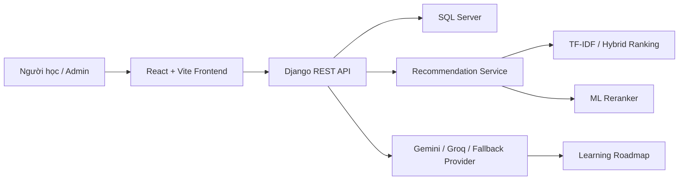

# EduPath - Course Recommendation & Learning Roadmap Platform

[](https://react.dev/)
[](https://www.typescriptlang.org/)
[](https://vite.dev/)
[](https://www.djangoproject.com/)
[](https://www.django-rest-framework.org/)
[](https://www.microsoft.com/sql-server)

EduPath là hệ thống gợi ý khóa học và xây dựng lộ trình học tập cá nhân hóa. Dự án kết hợp React/Vite ở frontend, Django REST Framework ở backend, SQL Server cho lưu trữ dữ liệu, cùng mô hình gợi ý dựa trên hồ sơ người học, TF-IDF/hybrid ranking và tùy chọn ML reranking.

## Nội Dung

- [Tính năng chính](#tính-năng-chính)
- [Công nghệ sử dụng](#công-nghệ-sử-dụng)
- [Kiến trúc tổng quan](#kiến-trúc-tổng-quan)
- [Cấu trúc thư mục](#cấu-trúc-thư-mục)
- [Cài đặt và chạy local](#cài-đặt-và-chạy-local)
- [Lệnh hữu ích](#lệnh-hữu-ích)
- [API chính](#api-chính)
- [Ghi chú triển khai](#ghi-chú-triển-khai)

## Tính Năng Chính

### Người học

- Đăng ký, đăng nhập và xác thực bằng JWT.
- Onboarding hồ sơ học tập: mục tiêu nghề nghiệp, kỹ năng, trình độ, sở thích.
- Dashboard khóa học, tìm kiếm khóa học và xem chi tiết khóa học.
- Gợi ý khóa học cá nhân hóa theo hồ sơ người học.
- Lưu khóa học yêu thích và quản lý lịch sử tìm kiếm.
- Tạo lộ trình học tập theo mục tiêu bằng AI provider hoặc fallback TF-IDF.
- Đánh giá, bình chọn review và tham gia cộng đồng bài viết/bình luận.

### Quản trị

- Dashboard tổng quan dữ liệu và chất lượng hệ thống gợi ý.
- Quản lý khóa học, danh mục, tag và người dùng.
- Import dữ liệu khóa học từ CSV.
- Theo dõi log gợi ý để kiểm tra điểm số, ngữ cảnh và hành vi hệ thống.
- Huấn luyện và đánh giá mô hình ML reranking.

## Công Nghệ Sử Dụng

| Layer | Công nghệ |
| --- | --- |
| Frontend | React 19, TypeScript, Vite, React Router, Axios, Font Awesome |
| Backend | Python, Django 6, Django REST Framework, Simple JWT |
| Database | Microsoft SQL Server qua `mssql-django` |
| AI/ML | TF-IDF/hybrid ranking, scikit-learn Logistic Regression, joblib, Google Gemini/Groq tùy chọn |
| Tooling | ESLint, npm, Django management commands |

## Kiến Trúc Tổng Quan



## Cấu Trúc Thư Mục

```text
DACS/
  backend/
    api/                       Django app: models, serializers, views, services
    api/management/commands/   Import, seed, train và evaluate recommender
    data/                      Dataset CSV dùng cho import demo
    server/                    Django project settings/urls
    sql/                       SQL script hỗ trợ database
    manage.py
    requirements.txt
  frontend/
    src/
      pages/student/           Giao diện người học
      pages/admin/             Giao diện quản trị
      services/                API client và auth helper
      components/              Routing/shared UI
    package.json
  README.md
```

## Cài Đặt Và Chạy Local

### 1. Yêu cầu môi trường

- Python 3.12+
- Node.js 20+
- Microsoft SQL Server
- ODBC Driver 17 for SQL Server
- Git

### 2. Clone project

```powershell
git clone https://github.com/Benn-TVM/DACS_EduPath.git
cd DACS_EduPath
```

### 3. Cấu hình backend

```powershell
cd backend
python -m venv venv
.\venv\Scripts\Activate.ps1
pip install -r requirements.txt
copy .env.example .env
```

Cập nhật file `backend/.env` theo SQL Server local của bạn:

```env
SECRET_KEY=change-me
DEBUG=True
ALLOWED_HOSTS=localhost,127.0.0.1,testserver

DB_NAME=DACS_DB
DB_USER=sa
DB_PASSWORD=your-sqlserver-password
DB_HOST=127.0.0.1
DB_PORT=1433

CORS_ALLOW_ALL_ORIGINS=True

GEMINI_API_KEY=
GROQ_API_KEY=
```

Chạy migration:

```powershell
python manage.py migrate
```

Tạo tài khoản admin:

```powershell
python manage.py createsuperuser
```

Import dữ liệu khóa học mẫu nếu cần:

```powershell
python manage.py import_coursera_courses --source data/coursera_courses.csv
```

Chạy backend:

```powershell
python manage.py runserver
```

Backend mặc định chạy tại:

```text
http://127.0.0.1:8000/
```

### 4. Cấu hình frontend

Mở terminal khác:

```powershell
cd frontend
npm install
copy .env.example .env
npm run dev
```

Frontend mặc định chạy tại:

```text
http://127.0.0.1:5173/
```

File `frontend/.env`:

```env
VITE_API_BASE_URL=http://127.0.0.1:8000/api/
```

## Lệnh Hữu Ích

### Backend

```powershell
python manage.py runserver
python manage.py migrate
python manage.py createsuperuser
python manage.py import_coursera_courses --source data/coursera_courses.csv
python manage.py seed_ml_demo_interactions
python manage.py train_course_reranker
python manage.py evaluate_recommenders --k 5
```

### Frontend

```powershell
npm run dev
npm run build
npm run lint
npm run preview
```

## API Chính

| Nhóm | Endpoint |
| --- | --- |
| Auth | `POST /api/auth/register/`, `POST /api/auth/login/`, `POST /api/auth/refresh/`, `GET /api/auth/me/` |
| Onboarding | `GET /api/auth/onboarding/`, `PUT /api/auth/onboarding/` |
| Course | `GET /api/courses/`, `GET /api/courses/<id>/`, `POST /api/courses/compare/` |
| Search | `GET /api/search/`, `GET /api/search/history/`, `DELETE /api/search/history/` |
| Recommendation | `GET /api/recommendations/`, `GET /api/dashboard/stats/` |
| Roadmap | `POST /api/roadmap/generate/`, `GET /api/roadmaps/`, `GET /api/roadmaps/<id>/` |
| Saved Course | `GET /api/saved-courses/`, `POST /api/saved-courses/`, `DELETE /api/saved-courses/<course_id>/` |
| Reviews | `GET /api/reviews/`, `POST /api/reviews/`, `POST /api/reviews/<id>/vote/` |
| Community | `GET /api/posts/`, `POST /api/posts/`, `POST /api/posts/<id>/vote/`, `GET /api/posts/<id>/comments/` |
| Admin | `GET /api/admin/stats/`, `GET /api/admin/users/`, `GET/POST/PUT/DELETE /api/admin/courses/` |

## Ghi Chú Triển Khai

- Không commit `backend/.env`, virtual environment, `node_modules`, build output, file upload trong `backend/media` hoặc report sinh ra trong `backend/reports`.
- Dataset demo `backend/data/coursera_courses.csv` được giữ lại để thuận tiện import dữ liệu khóa học.
- Nếu không cấu hình `GEMINI_API_KEY` hoặc `GROQ_API_KEY`, hệ thống vẫn có fallback provider để tạo lộ trình dựa trên thuật toán ranking nội bộ.
- Model ML reranking được lưu trong `backend/ml_models/` và được ignore khỏi Git vì là artifact sinh ra từ dữ liệu huấn luyện.
- Khi deploy production, cần tắt `DEBUG`, cấu hình `ALLOWED_HOSTS`, giới hạn CORS và dùng secret key riêng.

## Tác Giả

Repository: [Benn-TVM/DACS_EduPath](https://github.com/Benn-TVM/DACS_EduPath)
